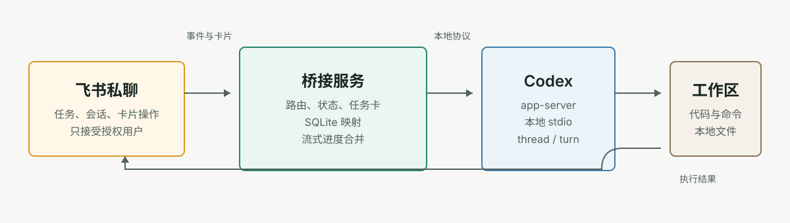
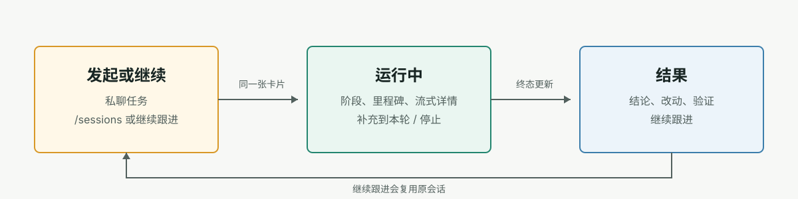

# codex-feishu-bridge

可信飞书私聊与本地 Codex 的轻量桥接服务。



## 启动

```bash
go install github.com/sparklyi/codex-feishu-bridge/cmd/codex-feishu-bridge@latest
codex-feishu-bridge init-config

export FEISHU_APP_SECRET=...
codex-feishu-bridge doctor
codex-feishu-bridge serve
```

`app_server.command` 使用官方安装器提供的独立 Codex CLI，不使用 Codex Desktop 应用包内的可执行文件。

## 配置

```yaml
feishu:
  app_id: cli_xxx
  app_secret_env: FEISHU_APP_SECRET
  card_display_mode: preview
security:
  allowed_open_ids: [ou_xxx]
app_server:
  command: codex
  experimental_api: false
workspace:
  default: /path/to/repo
runtime:
  stream_update_interval_milliseconds: 200
  stream_update_attempt_timeout_milliseconds: 1500
  stream_retry_delay_milliseconds: 800
```

完整字段见 [config.example.yaml](config.example.yaml)。需要代理时配置 `feishu.proxy_url`；修改配置后重启服务。

## 使用



| 输入或操作 | 结果 |
| --- | --- |
| 私聊发送任务 | 创建本地 Codex 任务 |
| `@backend 修复测试` | 在 `projects.backend` 工作区执行 |
| `/sessions` | 选择并接管桌面 Codex 会话 |
| 补充到本轮 | 向当前 turn 追加约束 |
| 继续跟进 | 基于原会话开始下一轮 |

## 运维

```bash
codex-feishu-bridge doctor [--config path]
codex-feishu-bridge tasks list [--config path]
codex-feishu-bridge tasks show [--config path] <task_id>
```

`doctor` 会显示实际 Codex CLI 版本；CLI 支持 schema 导出时还会校验桥接依赖的稳定请求契约，最后执行真实 app-server 握手。

## 边界

- 仅处理私聊，且仅允许 `security.allowed_open_ids` 中的用户。
- 继续、补充与停止均校验任务创建者。
- 本地状态位于 `~/.codex-feishu-bridge/state.db`；卡片会隐藏绝对路径、密钥和完整 thread ID。
- 所有 turn 固定使用 `danger-full-access` 与 `approvalPolicy: never`。
- `app_server.experimental_api` 默认关闭；仅在桥接功能明确依赖实验协议时才打开。
- App Server 连接中断时，活动任务会立刻标记失败并发送终态卡；使用 launchd 或 systemd 守护进程自动拉起服务。

## 相关文档

- [飞书机器人接入教程](docs/feishu-quickstart.zh-CN.md)
- [安全模型](docs/security.md)
- [本地开发](docs/development.md)
- [故障排查](docs/troubleshooting.md)

## License

MIT
