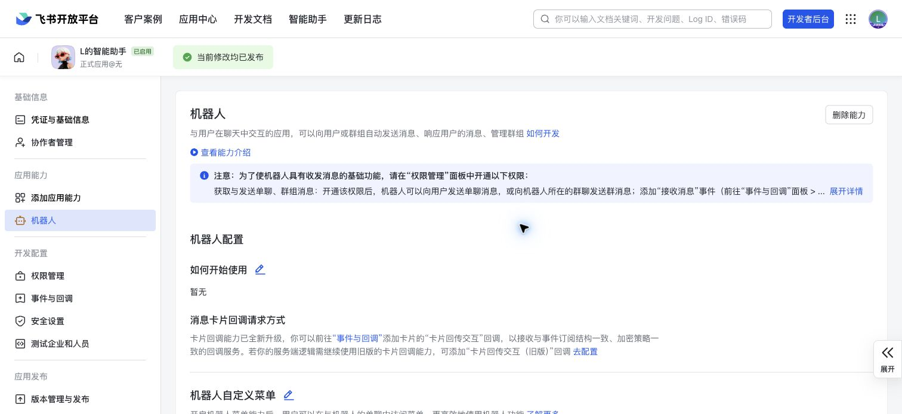
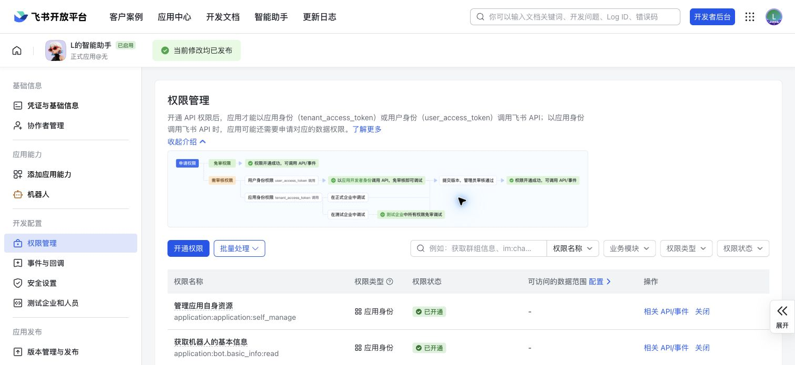
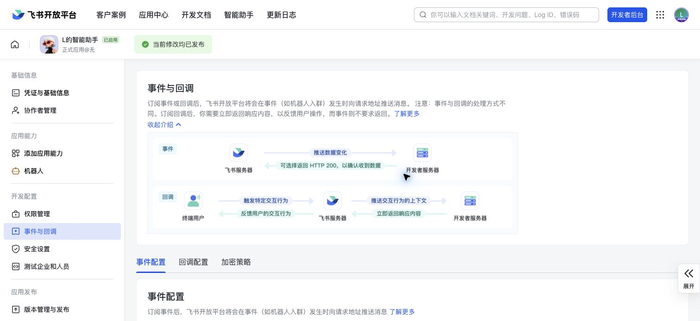
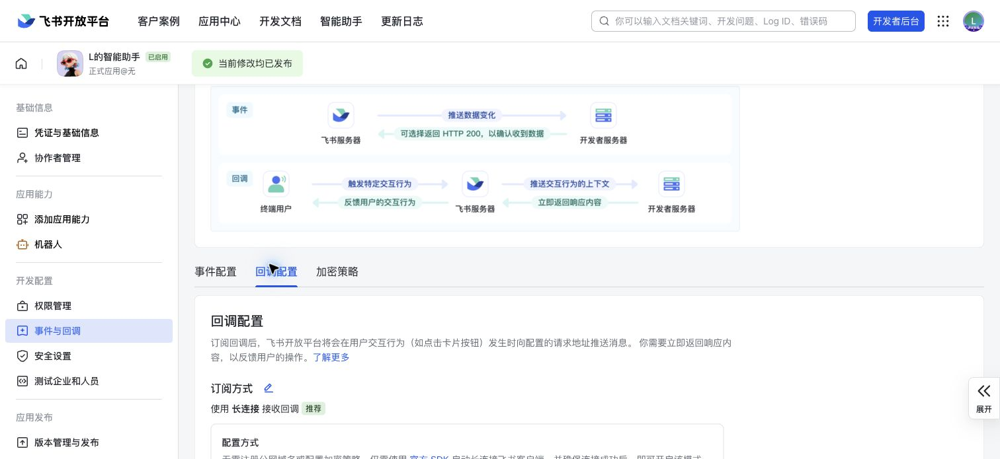

# 飞书机器人接入教程

这份教程从零开始配置一个飞书机器人，通过 WebSocket 长连接连接到本机 `codex-feishu-bridge`，并完成一次真实 Codex 任务和卡片回调验证。

## 准备

本机需要：

- Go 1.26
- 已登录可用的 Codex CLI
- 一个有权限创建自建应用的飞书账号
- 当前仓库代码

```bash
git clone https://github.com/sparklyi/codex-feishu-bridge.git
cd codex-feishu-bridge
go test ./...
go build -o bin/codex-feishu-bridge ./cmd/codex-feishu-bridge
```

## 1. 创建飞书自建应用

打开 [飞书开放平台开发者后台](https://open.feishu.cn/app)，创建一个企业自建应用。应用名称可以随意，例如 `Codex Bridge`。

创建后进入应用详情页，确认左侧导航里能看到：

- 凭证与基础信息
- 添加应用能力
- 机器人
- 权限管理
- 事件与回调
- 版本管理与发布

## 2. 复制 App ID，保存 App Secret

进入“凭证与基础信息”，复制 `App ID`。`App Secret` 只放到本机环境变量，不要写进 `config.yaml`，也不要提交到 Git。

```bash
export FEISHU_APP_SECRET='<your app secret>'
```

本项目的脚本和配置只保存环境变量名 `FEISHU_APP_SECRET`，不会保存 secret 明文。

## 3. 启用机器人能力

进入“添加应用能力”，添加“机器人”。然后进入“机器人”页，确认能力已启用。



## 4. 开通权限

进入“权限管理”，至少开通这些权限：

| 用途 | 权限说明 |
| --- | --- |
| 发送开始卡片和结果卡片 | 以应用的身份发消息 |
| 接收私聊消息 | 读取用户发给机器人的单聊消息 |
| 接收群聊 @ 机器人消息 | 获取群组中用户 @ 机器人消息 |
| 接收群聊中其他机器人和用户 @ 当前机器人的消息 | 获取群组中其他机器人和用户 @ 当前机器人的消息 |

如果只做 MVP 私聊联调，单聊读取和发消息权限就足够；如果要放进群里，再补齐群聊相关权限。



## 5. 配置事件长连接

进入“事件与回调”。

在“事件配置”里选择“长连接”，添加事件：

- `接收消息`
- 事件 key：`im.message.receive_v1`

长连接模式不需要公网域名，不需要配置 HTTP 回调地址。



## 6. 配置卡片回调长连接

仍然在“事件与回调”，切到“回调配置”，选择“长连接”，添加回调：

- `卡片回传交互`
- callback key：`card.action.trigger`

这个回调用于处理结果卡片里的 Continue、快捷按钮和表单提交。



## 7. 发布应用版本

权限、事件或回调有变更后，飞书会提示“版本发布后，当前修改方可生效”。进入“版本管理与发布”，创建版本并发布。

如果页面提示“本次发布免审核”，提交后会立即生效。否则需要企业管理员审核后才会在线上可用。

## 8. 获取自己的 open_id

`codex-feishu-bridge` 使用 `security.allowed_open_ids` 做用户 allowlist。最稳妥的方式是用项目自带脚本从真实消息中捕获 open_id。

先启动捕获脚本：

```bash
export FEISHU_APP_SECRET='<your app secret>'
scripts/capture-open-id.sh --app-id cli_xxx
```

然后在飞书里打开机器人私聊，发送：

```text
ping
```

脚本会输出：

```text
open_id=ou_xxx
chat_id=oc_xxx
chat_type=private
message_id=om_xxx
```

把 `open_id` 保存下来。`chat_id` 和 `message_id` 只用于排查，不需要写入配置。

## 9. 一键生成本地配置

用脚本生成 `~/.codex-feishu-bridge/config.yaml`：

```bash
scripts/init-local-config.sh \
  --app-id cli_xxx \
  --allowed-open-id ou_xxx \
  --workspace "$(pwd)" \
  --config ~/.codex-feishu-bridge/config.yaml \
  --state-db ~/.codex-feishu-bridge/state.db \
  --log-dir ~/.codex-feishu-bridge/logs \
  --force
```

脚本会：

- 创建配置文件，权限为 `0600`
- 创建 SQLite 和日志目录，目录权限为 `0700`
- 写入 `app_id`、allowlist、workspace、state/log 路径
- 只写入 `app_secret_env: FEISHU_APP_SECRET`，不会写入 secret 明文

## 10. 检查本地环境

```bash
export FEISHU_APP_SECRET='<your app secret>'
go run ./cmd/codex-feishu-bridge doctor --config ~/.codex-feishu-bridge/config.yaml
```

期望所有关键项为 `OK`：

- `config.load`
- `feishu.app_id`
- `feishu.app_secret`
- `workspace.default`
- `paths.state_db`
- `paths.log_dir`
- `codex.command`
- `codex.exec.json`
- `codex.exec.resume`

## 11. 启动服务

```bash
export FEISHU_APP_SECRET='<your app secret>'
go run ./cmd/codex-feishu-bridge serve --config ~/.codex-feishu-bridge/config.yaml
```

看到类似日志表示 WebSocket 已连接：

```text
[event-dispatch is ready]
[client ready]
connected to wss://msg-frontier.feishu.cn/ws/v2...
```

## 12. 完成真实回调测试

在飞书机器人私聊中发送：

```text
Reply with exactly OK.
```

期望看到：

1. 机器人立即返回 `Codex task started ...` 开始卡片。
2. Codex 执行完成后返回 `Codex task succeeded ...` 结果卡片。
3. 结果正文包含 `OK`。
4. 点击结果卡片的 Continue。如果没有填 follow-up 文本，服务会返回 `Follow-up text is required.`，这说明卡片回调已经通过长连接到达本机服务。
5. 点击 Summarize 或 Explain error 会立即作为续写请求发送给 Codex；点击 Run tests 或 MR description 会先返回确认卡片。

私聊里也可以用项目别名前缀：

```text
@backend fix the failing router test
```

群聊里需要 @ 机器人并指定项目：

```text
@Codex @backend fix the failing router test
```

如果群聊里发送 `@Codex fix the failing router test`，服务会返回项目选择卡片。旧的 `/codex` 命令不再作为任务入口，会返回迁移提示。

本地也可以确认任务状态：

```bash
go run ./cmd/codex-feishu-bridge tasks list --config ~/.codex-feishu-bridge/config.yaml
go run ./cmd/codex-feishu-bridge tasks show --config ~/.codex-feishu-bridge/config.yaml <task_id>
```

## 常见问题

### 看不到开始卡片

先跑：

```bash
go run ./cmd/codex-feishu-bridge doctor --config ~/.codex-feishu-bridge/config.yaml
```

重点检查：

- `FEISHU_APP_SECRET` 是否已 export
- 应用是否发布了最新版本
- `im.message.receive_v1` 是否在“事件配置”里
- 消息是否发给了正确的机器人
- 发送者 open_id 是否在 `security.allowed_open_ids`

### 只能收到消息，不能发卡片

检查“权限管理”里是否开通“以应用的身份发消息”，并确认版本已发布。

### Continue 没有反应

检查“回调配置”里是否添加了 `card.action.trigger`，并确认使用的是“长连接”模式。

### 群聊里没有响应

群聊中未授权用户会被静默忽略。群聊场景还需要开通群消息相关权限，并且需要 @ 机器人；没有项目别名时会返回项目选择卡片。

### 不想把 secret 写入 shell 历史

可以把 secret 放到本机未提交的 `.env.local`：

```bash
printf 'export FEISHU_APP_SECRET=%q\n' '<your app secret>' > .env.local
chmod 600 .env.local
source .env.local
```

`.env.local` 已被 `.gitignore` 忽略。
