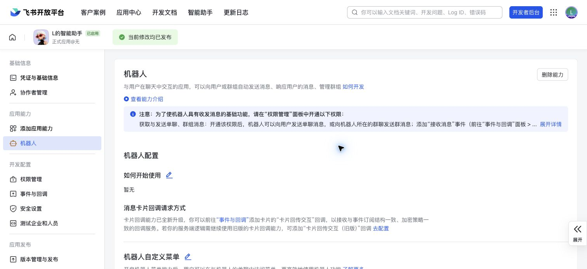
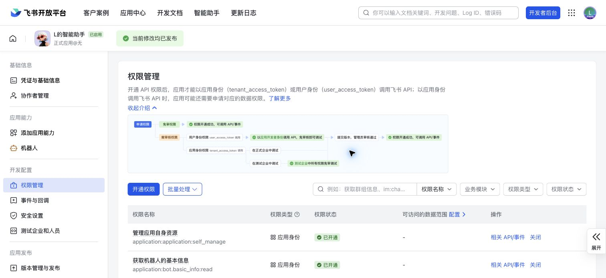
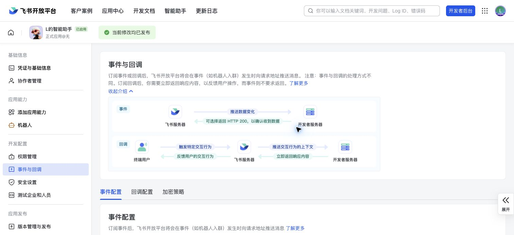
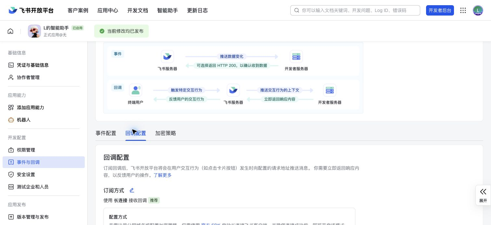

# 飞书机器人接入教程

这份教程从零开始配置一个飞书机器人，通过 WebSocket 长连接连接到本机 `codex-feishu-bridge`，并完成一次真实 Codex 任务、会话接管和卡片回调验证。

## 准备

本机需要：

- Go 1.26
- 已通过官方安装器安装、已登录且支持 `app-server` 的独立 Codex CLI；不要将 Desktop 应用包内的可执行文件配置为 `app_server.command`
- 一个有权限创建自建应用的飞书账号
- 当前仓库代码

```bash
git clone https://github.com/sparklyi/codex-feishu-bridge.git
cd codex-feishu-bridge
go test ./...
go build -o bin/codex-feishu-bridge ./cmd/codex-feishu-bridge
```

## 1. 创建飞书自建应用

打开 [飞书开放平台开发者后台](https://open.feishu.cn/app)，创建一个企业自建应用。应用名称可以使用 `Codex Bridge`。

创建后确认左侧导航里能看到：

- 凭证与基础信息
- 添加应用能力
- 机器人
- 权限管理
- 事件与回调
- 版本管理与发布

## 2. 保存 App ID 和 App Secret

进入“凭证与基础信息”，复制 `App ID`。`App Secret` 只放在本机环境变量，不要写进 `config.yaml`，也不要提交到 Git。

```bash
export FEISHU_APP_SECRET='<your app secret>'
```

## 3. 启用机器人与权限

在“添加应用能力”中启用“机器人”。在“权限管理”中至少开通：

| 用途 | 权限说明 |
| --- | --- |
| 发送任务和进度卡片 | 以应用的身份发消息 |
| 接收私聊消息 | 读取用户发给机器人的单聊消息 |
| 接收群聊 @ 机器人消息 | 获取群组中用户 @ 当前机器人消息 |





## 4. 配置事件和卡片回调长连接

进入“事件与回调”。

在“事件配置”里选择“长连接”，添加事件：

- `接收消息`
- 事件 key：`im.message.receive_v1`

在“回调配置”里也选择“长连接”，添加：

- `卡片回传交互`
- callback key：`card.action.trigger`

长连接模式不需要公网回调地址。





## 5. 发布应用版本

权限、事件或回调有变更后，进入“版本管理与发布”创建版本并发布。企业管理员审核完成后，配置才会在线上生效。

## 6. 获取自己的 open_id

`codex-feishu-bridge` 使用 `security.allowed_open_ids` 做 allowlist。启动捕获脚本：

```bash
export FEISHU_APP_SECRET='<your app secret>'
scripts/capture-open-id.sh --app-id cli_xxx
```

然后在飞书里给机器人发送任意消息。脚本会输出：

```text
open_id=ou_xxx
chat_id=oc_xxx
chat_type=private
message_id=om_xxx
```

## 7. 生成本地配置

```bash
scripts/init-local-config.sh \
  --app-id cli_xxx \
  --allowed-open-id ou_xxx \
  --workspace "$(pwd)" \
  --config ~/.codex-feishu-bridge/config.yaml \
  --state-db ~/.codex-feishu-bridge/state.db \
  --force
```

脚本会创建权限为 `0600` 的配置文件和 SQLite 目录，并写入 `app_server`、workspace 和 allowlist。App Secret 始终只以环境变量名保存。

## 8. 检查本机环境

```bash
export FEISHU_APP_SECRET='<your app secret>'
go run ./cmd/codex-feishu-bridge doctor --config ~/.codex-feishu-bridge/config.yaml
```

关键项应为 `OK`：

- `config.load`
- `feishu.app_id`
- `feishu.app_secret`
- `workspace.default`
- `paths.state_db`
- `app_server.command`
- `app_server.probe`

`app_server.probe` 会启动本机 app-server 进程并列出可见的 Codex 线程。

## 9. 启动服务

```bash
export FEISHU_APP_SECRET='<your app secret>'
go run ./cmd/codex-feishu-bridge serve --config ~/.codex-feishu-bridge/config.yaml
```

## 10. 完成真实回调测试

在飞书机器人私聊中发送：

```text
Reply with exactly OK.
```

期望看到：

1. 机器人立即返回开始卡片，并持续更新进度。
2. 任务完成后，开始卡片变为结果卡片。
3. 在结果卡片中提交继续内容，Codex 会在同一 thread 中继续处理。
4. 运行中点击停止，当前 turn 会被中断。
5. 默认全权限、免确认运行；即使 Codex 发出残余授权请求，桥接也会自动放行。

## 11. 接管桌面会话

先在 Codex Desktop 中打开一个线程。然后在飞书机器人私聊发送：

```text
/sessions
```

选择需要接管的会话。服务会发送一个绑定任务卡片；在该卡片中输入后续任务，即可通过 app-server 恢复桌面线程。

群聊需要 @ 机器人并指定项目：

```text
@Codex @backend fix the failing router test
```

本机也可以确认任务状态：

```bash
go run ./cmd/codex-feishu-bridge tasks list --config ~/.codex-feishu-bridge/config.yaml
go run ./cmd/codex-feishu-bridge tasks show --config ~/.codex-feishu-bridge/config.yaml <task_id>
```

## 常见问题

### 看不到任务卡片

先运行 `doctor`，并检查：

- `FEISHU_APP_SECRET` 是否已 export
- 应用是否已发布最新版本
- `im.message.receive_v1` 是否已在事件配置中启用
- 发送者 open_id 是否在 `security.allowed_open_ids`

### 卡片按钮没有反应

检查“回调配置”里是否添加了 `card.action.trigger`，并确认使用的是“长连接”。

### `/sessions` 没有会话

确认 Codex Desktop 或本机 Codex 已打开过至少一个线程，并检查 `doctor` 的 `app_server.probe`。

### 不想把 secret 写入 shell 历史

可以把 secret 放到本机未提交的 `.env.local`：

```bash
printf 'export FEISHU_APP_SECRET=%q\n' '<your app secret>' > .env.local
chmod 600 .env.local
source .env.local
```

`.env.local` 已被 `.gitignore` 忽略。
